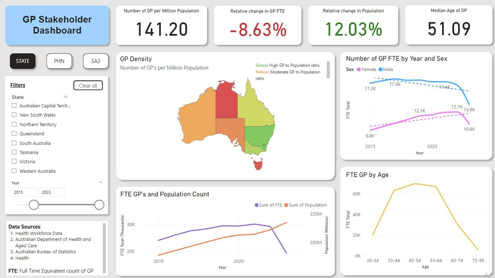
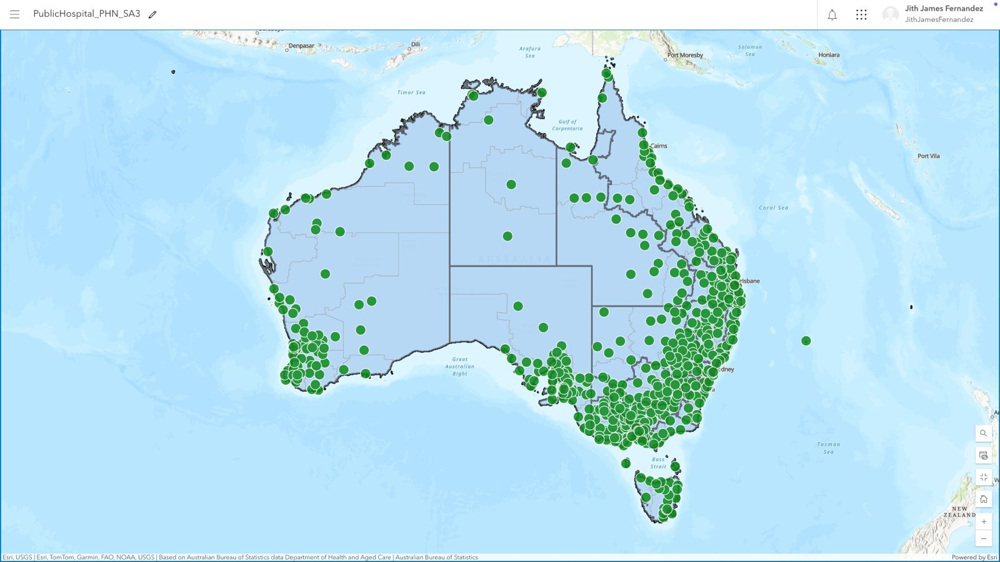

# Public Hospital Mapping and GP Workforce Dashboard

**Comprehensive Analysis of Public Hospital Distribution and GP Workforce Trends in WA**

## Description
This project combines a geospatial analysis of public hospital distributions with an interactive GP Workforce Dashboard to provide actionable insights into healthcare accessibility across Western Australia. By using ArcGIS for mapping and Power BI for visualisation, the project highlights underserved areas and GP workforce trends to support data-driven healthcare planning.

---

## Project Overview
The project aims to address critical healthcare challenges by analysing:

1. **Public Hospital Distribution**: Utilising ArcGIS to map public hospital locations relative to GP service areas and identify underserved regions.
2. **GP Workforce Trends**: Developing an interactive Power BI dashboard to visualise GP availability, workforce distribution, and population trends.

### Key Insights
- **Decrease in GP Availability**: GP availability, measured as Full-Time Equivalents (FTE), declined after 2022, reflecting challenges like workforce ageing, retirements, and fewer new practitioners, particularly in WA where the GP-to-population ratio is below the national average.
- **Narrowing Gender Gap**: Analysis of GP FTEs by gender reveals that the gap between male and female GPs has been narrowing over the years. While male GPs historically constituted the majority, the rise in female practitioners suggests a significant shift in the gender balance within the workforce.

---

## Features
- **Geospatial Mapping (ArcGIS)**:
  - Visualises public hospital distributions at Primary Health Network (PHN) and Statistical Area 3 (SA3) levels.
  - Highlights spatial relationships between GP services and hospital locations.
- **Interactive Dashboard (Power BI)**:
  - Displays GP workforce density, trends, and accessibility metrics.
  - Integrates datasets from sources such as Health Workforce Data, ABS, and the Department of Health.
- **Data Integration**:
  - Combines geospatial and workforce data to deliver holistic insights into WA healthcare challenges.

---

## Technologies Used
- **ArcGIS**: For geospatial analysis and mapping.
- **Power BI**: For dashboard creation and interactive visualisations.
- **Power Query**: For data transformation and query optimisation.
- **Microsoft Excel**: For data cleaning and organisation.

---

## Visualisations

### GP Workforce Dashboard 

*Interactive Power BI dashboard showcasing GP workforce density, FTE trends, and service accessibility.*

### Public Hospital Mapping
  
*ArcGIS map visualising hospital distributions across PHN and SA3 levels.*

### Data Modelling
 
*Data Modelling of all the datasets used in the Power BI dashboard*
